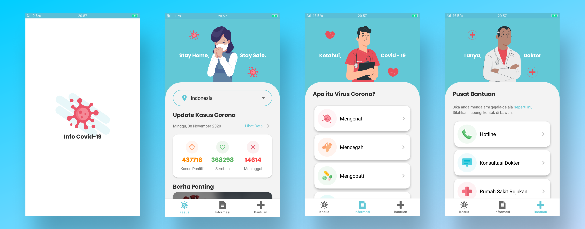

# Info-Covid-19

Aplikasi ini menyediakan kasus, informasi, dan pusat bantuan seputar COVID-19. Dibuat menggunakan [Kawal Corona API](https://kawalcorona.com/api/) dari ETHICAL HACKER INDONESIA.

## Tampilan Aplikasi

## Fitur

Aplikasi Info Covid-19 memungkinkan Anda:
- Melihat perkembangan kasus COVID-19 di Indonesia dan Dunia setiap harinya
- Melihat Perkembangan kasus COVID-19 di berbagai Provinsi Indonesia setiap harinya
- Berita terkini seputar COVID-19
- Informasi tentang mengenal, mencegah, mengobati, mengantisipasi, dan gejala-gejala COVID-19
- Pusat bantuan berupa hotline, konsultasi dokter, dan daftar rumah sakit rujukan COVID-19

## Lisensi

Didistribusikan di bawah Lisensi MIT. Lihat `LICENSE` untuk informasi lebih lanjut.

## Kontak

Mochammad Arya Salsabila - Aryasalsabila789@gmail.com
